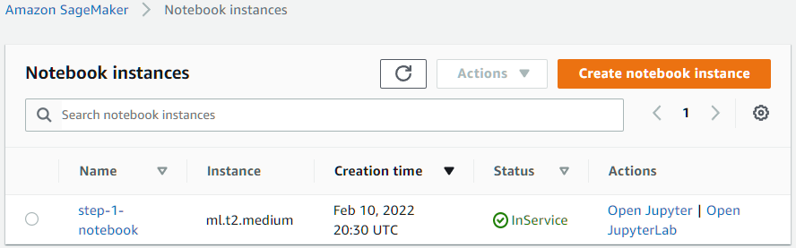
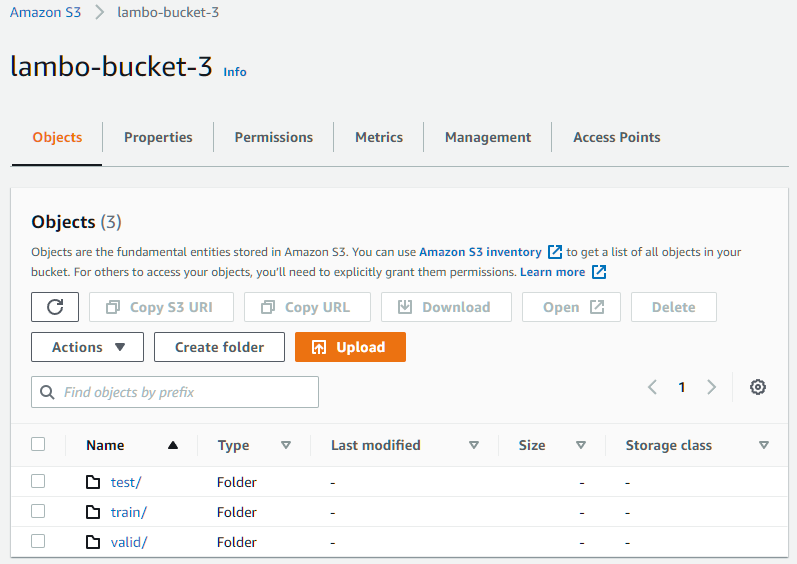
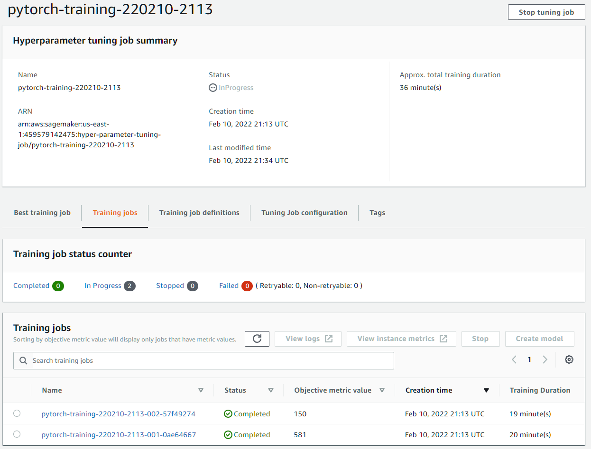
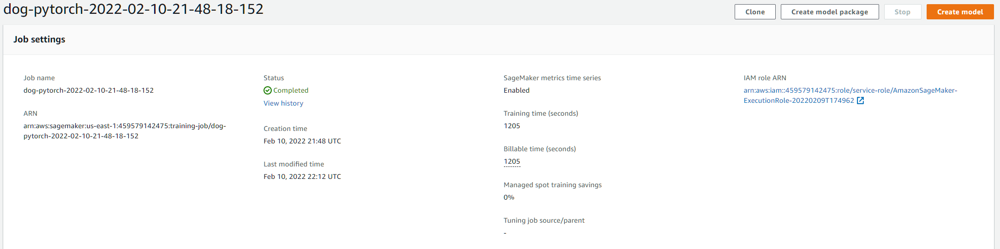
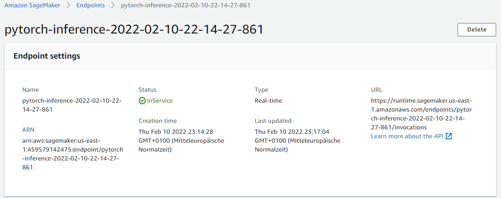
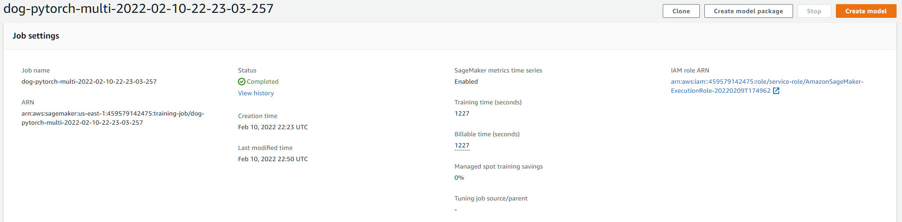
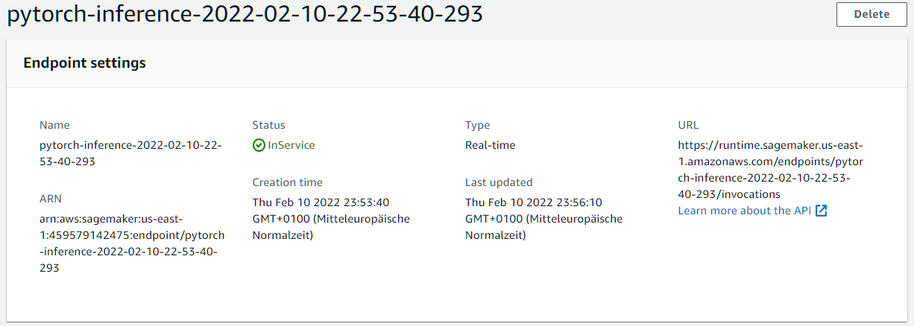
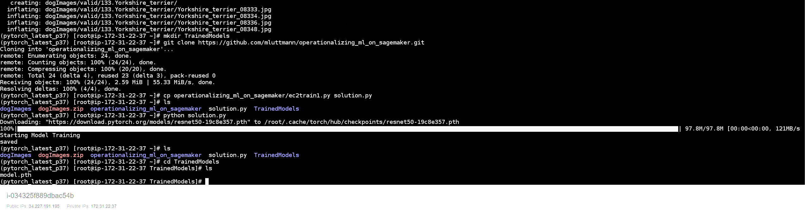

# Operationalizing Machine Learning on SageMaker

## Step 1: Training and deployment on Sagemaker

### Initial Setup & Sagemaker Dashboard

I choosed the `ml.t2.medium` instance because it is the cheapest instance and the notebook will not do heavy tasks but rather start other instances to take over tasks like model training and hosting of end points for inference. This instance is also free for starter accounts (250h).

### Download data to an S3 bucket

After executing the first three cells of the notebook, the data is uploaded to the S3 bucket:

### Training and Deployment

These are the training jobs for hyperparameter tuning:

Then, a training job with the best parameters were created:

As soon as all cells are executed, an endpoint is deployed:

And the endpoint for the model trained on multiple instances:

After that, a training job with 4 instances were created:

And the corresponding end point:

## Step 2: EC2 Training

### Training
Since the model is trained by the Python script itself, I choosed the same instance that was used in step 1 to train the model. The limiting factor is the CPU because with a batch size of 2 memory consumption should be no issue. 

To create the `solution.py` file, I copied the file from a Git repository because I had problems pasting the code due to line endings on my Windows machine even though they were LF formatted.

### Comparison

After training, the model data is in the `TrainedModels` directory:

There are a few differences between the `ec2train1.py` Python file and the `train_and_deploy-solution.ipynb` Jupyter notebook. The latter used the sagemaker and boto3 modules to start other instances to perform hyperparameter tuning and model training. Additionally, the trained model were also uploaded to S3 and an end point was deployed based on this model. Also, when using the Python file, the model is trained in the same instance that launched that file.

## Step 3: Step 3: Lambda function setup