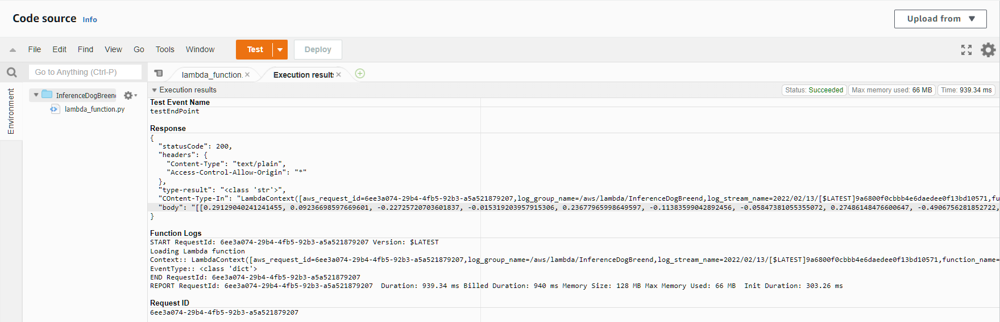
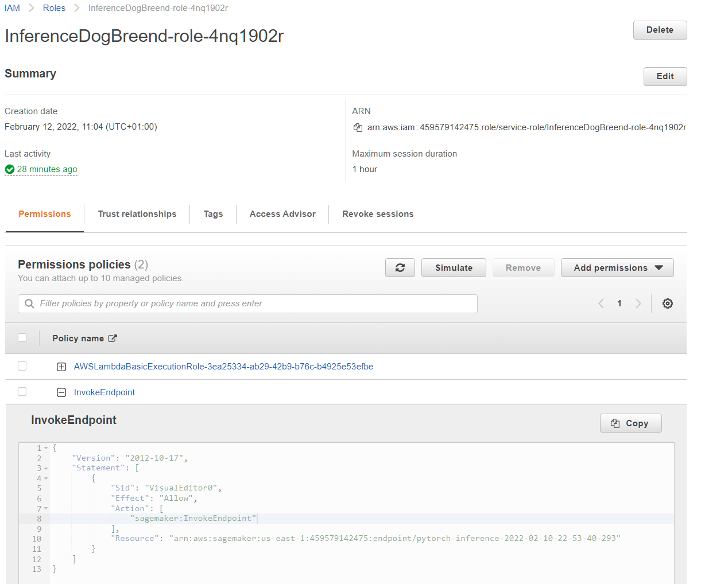

# Operationalizing Machine Learning on SageMaker

This README.md file is also available in my GitHub repository: https://github.com/mluttmann/operationalizing_ml_on_sagemaker/blob/master/README.md

## Step 1: Training and deployment on Sagemaker

### Initial Setup & Sagemaker Dashboard

I chose the `ml.t2.medium` instance because it is the cheapest instance and the notebook will not do heavy tasks but rather start other instances to take over tasks like model training and hosting of end points for inference. This instance is also free for starter accounts (250h).


### Download data to an S3 bucket

After executing the first three cells of the notebook, the data is uploaded to the S3 bucket:


### Training and Deployment

These are the training jobs for hyperparameter tuning:


Then, a training job with the best parameters was created:


As soon as all cells are executed, an endpoint is deployed:


After that, a training job with 4 instances was created:


And the corresponding is end point looks like this:


## Step 2: EC2 Training

### Training
Since the model is trained by the Python script itself, I chose the instance type `ml.m5.xlarge` that was used in step 1 to train the model. The limiting factor is the CPU because with a batch size of 2 memory consumption should be no issue. 

To create the `solution.py` file, I copied the file from my Git repository because I had problems pasting the code due to issues with the line endings on my Windows machine even though they were LF formatted.

### Comparison

After training, the model data is in the `TrainedModels` directory:


There are a few differences between the `ec2train1.py` Python file and the `train_and_deploy-solution.ipynb` Jupyter notebook. The latter used the sagemaker and boto3 modules to start other instances to perform hyperparameter tuning and model training. Additionally, the trained model was also uploaded to S3 and an end point was deployed based on this model. Also, when using the Python file, the model is trained in the same instance that launched that file.

## Step 3: Lambda function setup

The copied lambda function created a low-level service client called `sagemaker-runtime`. With this client the end point `pytorch-inference-2022-02-10-22-53-40-293` was invoked with the input data. The input data is a JSON string containing a URL of an image. The response includes an array with 133 items. Each item represents a dog breed.

## Step 4: Security and testing

### Lambda function testing

The result of the test invokation was:



In particular, the prediction of the dog breed is as follows:

```
"[[0.29129040241241455, 0.09236698597669601, -0.22725720703601837, -0.015319203957915306,
0.23677965998649597, -0.11383599042892456, -0.05847381055355072, 0.27486148476600647,
-0.4906756281852722, -0.20211617648601532, 0.2845585346221924, 0.3589088022708893,
-0.17954136431217194, 0.4948332905769348, 0.35164138674736023, 0.11708064377307892,
0.1393270343542099, -0.009695982560515404, -0.06768028438091278, 0.30657655000686646,
0.3476860225200653, 0.009354041889309883, 0.3616390526294708, 0.21526005864143372,
-0.3939894735813141, -0.2194843292236328, 0.11416544020175934, -0.41521167755126953,
0.20515120029449463, 0.15794885158538818, 0.16599735617637634, 0.3397103250026703,
-0.07547847181558609, 0.2647486627101898, 0.11033309251070023, 0.22749385237693787,
0.023384757339954376, 0.21306048333644867, 0.05614205077290535, 0.15111513435840607,
0.12748223543167114, 0.09445430338382721, 0.08262565732002258, 0.3341158330440521,
-0.0014446023851633072, 0.15398329496383667, -0.13555453717708588, -0.06422480195760727,
-0.3707897365093231, -0.1876029372215271, 0.2642422318458557, -0.12411348521709442,
-0.18682421743869781, 0.12166378647089005, -0.17257077991962433, 0.24476630985736847,
0.26803943514823914, -0.05198201164603233, -0.24499790370464325, 0.01893189549446106,
0.3467886447906494, -0.14194726943969727, 0.12104789912700653, -0.06397537887096405,
-0.12935857474803925, -0.5840948820114136, -0.44736993312835693, 0.18073074519634247,
-0.10918319225311279, -0.32690680027008057, 0.3371661305427551, -0.12535613775253296,
-0.14384743571281433, 0.0026535324286669493, -0.05399174988269806, 0.2659657895565033,
-0.10177795588970184, -0.30402833223342896, 0.24835704267024994, -0.2535015940666199,
0.013320417143404484, 0.10502787679433823, -0.002468281891196966, 0.04065866768360138,
-0.27614283561706543, -0.02951922081410885, 0.4728386402130127, 0.006562267895787954,
0.007972748018801212, 0.11012637615203857, -0.10058604925870895, -0.2249458283185959,
-0.28868430852890015, -0.3044068515300751, -0.18267622590065002, -0.4458081126213074,
-0.05784570425748825, 0.04189775884151459, -0.47346022725105286, -0.5261051654815674,
-0.24830521643161774, -0.680610716342926, -0.007884684950113297, -0.38309016823768616,
-0.6286505460739136, -0.0741741955280304, 0.05601511895656586, -0.5789797306060791,
-0.0741630345582962, -0.595478355884552, -0.060991477221250534, -0.09963758289813995,
-0.381616473197937, -0.11770930141210556, 0.08815436065196991, -0.6566402316093445,
-0.05512397736310959, 0.032839108258485794, -0.728592038154602, -0.3582344949245453,
-0.6582112908363342, -0.3128925561904907, -0.41602444648742676, 0.03940277919173241,
0.021803317591547966, -0.5493916869163513, -0.41919469833374023, -0.2771565616130829,
0.08625993877649307, -0.23481972515583038, -0.5848506689071655, -0.6271758675575256,
-0.6693851351737976]]"
```

### Security 

In order to get the lambda function to work a appropriate permission policy has to be attached to the lambda function role. To be more secure, I created a custom policy that allows the lambda function to perform the `sagemaker:InvokeEndpoint` action on the configured end point `pytorch-inference-2022-02-10-22-53-40-293` only:



Using the `AmazonSageMakerFullAccess` policy could result in a leakage of sensitive data and should be avoided.

## Step 5: Concurrency and auto-scaling

### Concurrency

Often, processing one request at a time should be sufficient. But assuming there are high traffic situations, I provisioned 1 concurrency to decrease latency.


### Auto-scaling

Assuming that sometimes the number of requests tripels over a larger period of time, I set the number of maximum instances count to 3. Assuming that the number of requests will be relativly steady, I chose 30 seconds for the scale in cool down and scale out cooldown. As a first shot, I chose 20 as a target value. This variable is a threshold which means that as soon as the number of almost simultaneous requests exceeds this number, more instances are created. 